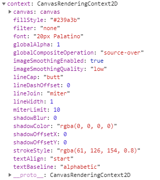
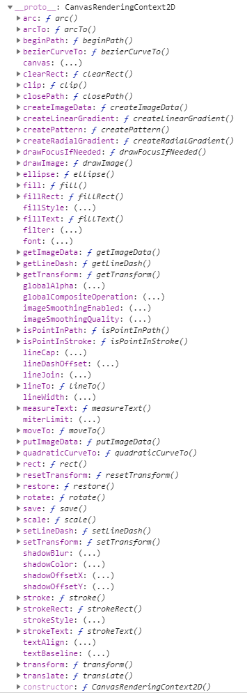

# Chapter 01 —— 基础知识

- 默认的 `canvas` 元素大小为 300x150 个屏幕像素
- 在设置 `canvas` 元素属性的宽度和高度时，不能使用 `px` 作为后缀
- 使用 CSS 设置 `canvas` 元素的大小与通过 `canvas` 元素属性的 `width` `height` 设置大小并不一样


虽然支持 Canvas 的浏览器普遍都允许在设置 Canvas 元素的 `width` 和 `height` 属性时使用 `px` 作为后缀。但是并不是 Canvas 规范所接受的。

Canvas 元素实际上有两套尺寸，一个是元素本身的大小，一个是元素绘图表面的大小。当设置元素的 `width`、`height` 属性时，实际上同时修改了该元素本身的大小与绘图表面大小；如果使用 CSS 来设置元素大小，那么只会改变元素本身大小，不会改变绘图表面大小。

## Canvas 元素 API

**属性：**

- `width` —— 元素绘图表面宽度
- `height` —— 元素绘图表面高度

**方法：**

- `getContext(contextType, contextAttributes)` —— 获取相关绘图环境，参数（`2d`、`webgl`、`webgl2`、`bitmaprenderer`）
- `toDataURL(type, quality)` —— 返回数据地址 dataURL, `type`(图形类型，默认 `image/png`), `quality`(图像质量)
- `toBlob(callback, type, quality)` —— 图像文件 Blob， `callback` 回调的参数为该 Blob 的引用，`type` 图像类型，`quality` 图像质量

详情参考： https://developer.mozilla.org/en-US/docs/Web/API/HTMLCanvasElement

## CanvasRenderingContext2D API

**属性：**



- `canvas` 该绘图环境所属的 canvas 元素
- `fillStyle` —— 绘制图像填充的颜色
- `font` —— 字体类型
- `globalAlpha` —— 全局透明设定
- `globalCompositeOperation` —— 某个物体绘制在其他物体之上时采用的绘制方式
- `lineCap` —— 如何绘制线段末端 `butt` / `round` / `square`;
- `lineDashOffset` —— 设置虚线偏移量 
- `lineJoin` —— 如何绘制线段交点 `bevel` / `round` / `miter` 
- `lineWidth` —— 绘制线段的宽度
- `miterLimit` —— 如何绘制 `miter` 形式的交点，默认值是 10
- `shadowBlur` —— 模糊效果程度 
- `shadowColor` —— 阴影颜色
- `shadowOffsetX` —— 阴影水平偏移距离
- `shadowOffsetY` —— 阴影垂直偏移距离
- `strokeStyle` —— 路径描边样式
- `textAlign` —— 绘制文本时的水平对齐方式
- `textBaseline` —— 绘制文本时
- `imageSmoothingEnabled` —— 图像平滑模式
- `imageSmoothingQuality` —— 图像平滑的质量 `low` / `medium` / `high`

**方法：**




参考：https://developer.mozilla.org/en-US/docs/Web/API/CanvasRenderingContext2D


## Canvas 状态的保存和恢复

在进行绘图操作的时候，需要频繁的设置 `context` 的属性值，但是有时候只想临时改变这些属性，用完恢复之前的状态。`context` 提供了两个 `save()` 和 `store()` 的 API。在开始做临时属性改变之前调用 `save()` 完成临时绘制之后调用 `store()` 就可以恢复到上一次调用 `save()` 之前的状态了。

`save()` 与 `store()` 方法可以嵌套使用，`save()` 方法会将当前的绘图环境压入栈顶，`store()` 方法则会从栈顶弹出上次绘图环境。


## Canvas 坐标系统

浏览器的事件对象中的鼠标坐标，是相对于浏览器窗口的坐标，并非实际 Canvas 自身的坐标系统。而我们通常需要知道鼠标发生在 Canvas 中的坐标，而不是相对于窗口的坐标，所以就需要坐标转换。

``` js
function CoordinateTransformation(canvas: HTMLCanvasElement, x: number, y: number) {
  const bbox = canvas.getBoundingClientRect();
  return {
    x: x - bbox.left * (canvas.width  / bbox.width),
    y: y - bbox.top  * (canvas.height / bbox.height)
  };
}
```