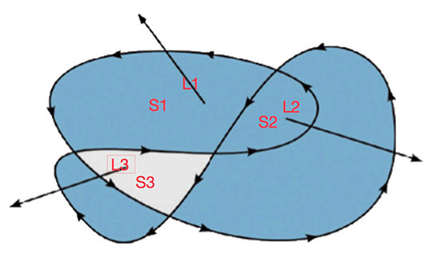

# Chapter 02 —— 绘制


Canvas API 中支出绘制的基本图形: 线段、矩形、圆弧、贝塞尔曲线，可以根据这些基本图形组合成任意需要的图形。


## Canvas 坐标系统

Canvas 的坐标系统默认左上角为原点， `X` 轴坐标向右延伸， `Y` 轴坐标向下延伸。

坐标系统可进行改变：

- 平移
- 旋转
- 缩放
- 自定义变换


浏览器的事件对象中的鼠标坐标，是相对于浏览器窗口的坐标，并非实际 Canvas 自身的坐标系统。而我们通常需要知道鼠标发生在 Canvas 中的坐标，而不是相对于窗口的坐标，所以就需要坐标转换。

``` js
function coordinateTransformation(canvas: HTMLCanvasElement, x: number, y: number) {
  const bbox = canvas.getBoundingClientRect();
  return {
    x: x - bbox.left * (canvas.width  / bbox.width),
    y: y - bbox.top  * (canvas.height / bbox.height)
  };
}
```


## Canvas 绘制模型

Canvas 渲染图像步骤：

1. 将图形/图像绘制到一个无限大的透明位图中，绘制是使用当前绘制环境样式
2. 将阴影绘制到另一幅为图中，使用当前绘制环境样式
3. 将阴影中每个像素的 `alpha` 分量乘以绘图环境对象的 `globalAlpha` 属性值
4. 将绘有阴影的位图与经过剪辑区域剪切过的 canvas 进行图像合成，使用当前合成模式参数
5. 将图形/图像每个颜色像素分量，乘以绘图环境对象的  `globalAlpha` 属性值
6. 将绘有图形/图形的位图，合成到当前经过剪辑区域裁剪过的 canvas 位图上，使用当前合成参数

**只有在启用阴影效果时才会执行 2 ~ 4 步骤。**

### 绘制矩形

- `clearRect(x, y, weight, height)`   —— 擦除范围内像素
- `strokeRect(x, y, weight, height)`  —— 为矩形描边
- `fillRect(x, y, weight, height)`    —— 填充矩形

描边属性：

- `strokeStyle`     —— 描边颜色
- `lineWidth`     —— 线宽
- `lineJoin`    —— 线连接方式 `round` | `bevel` | `miter` 默认 `miter`
- `miterLimit`    —— 斜接面限制比例 默认 10.0 


## 渐变 和 图案


### 创建渐变

canvas 支持 `线性渐变(linear)` 和 `径向渐变(radial)` 。


**线性渐变** 

需要两个点的坐标，canvas 会根据两点之间的连线来建立渐变效果。

使用 `createLinearGradient(x0, y0, x1, y1)` 方法创建渐变，返回一个 `CanvasGradient` 实例，通过它的 `addColorStop(percentage, color)` 方法添加 `颜色停止点`。


``` js
const gradient = context.createLinearGradient(0, 0, this.centerX, 0);
gradient.addColorStop(0.00, 'blue');
gradient.addColorStop(0.50, 'red');
gradient.addColorStop(1.00, 'yellow');
context.fillStyle = gradient;
context.fillRect(0, 0, canvas.width / 2,  canvas.height / 2);
```


**径向渐变** 


需要两个圆形，canvas 会根据两个圆之间的范围来建立渐变效果。


使用 `createRadialGradient(x0, y0, r0, x1, y1, r1)` 方法创建渐变实例，返回一个 `CanvasGradient` 实例


``` js
const gradient = context.createRadialGradient(
  this.centerX / 2, canvas.height / 2 * 1.5, 20,
  this.centerX / 2, canvas.height / 2 * 1.5, 200
);
gradient.addColorStop(0.0, 'blue');
gradient.addColorStop(0.5, 'yellow');
gradient.addColorStop(1.0, 'white');
context.fillStyle = gradient;
context.fillRect(0, this.centerY, canvas.width / 2, canvas.height / 2);
```


### 创建图案


Canvas 允许使用图案来对图形和文本进行填充和描边，图案可以为这些类型：

- image 元素
- canvas 元素
- video 元素

使用 `createPattern(image, repetition)` 方法创建图案，返回一个 `CanvasPattern` 实例。

- `image` - `HTMLImagesElement | HTMLCanvasElement | HTMLVideoElement`
- `repetition` - `repeat | repeat-x | repeat-y | no-repeat`


### 创建阴影

可以通过下列 4 个属性值来指定 图形、图像、文本 阴影效果：

- `shadowColor` CSS3 格式支持的颜色值
- `shadowOffsetX` 阴影的水平像素偏移，像素为单位，默认 0
- `shadowOffsetY` 阴影的垂直像素偏移，像素为单位，默认 0
- `shadowBlur` 阴影模糊值，默认 0

- 将 `shadowColor` 设置为 `underfined` 可以禁用阴影效果。
- 将 `shadowOffsetX` 和 `shadowOffsetY` 可以为负值，以显示内阴影效果。


阴影效果的绘制可能会比较耗时，特别是动画效果运用阴影效果。


### 路径、描边、填充

对于一些复杂的图像，都是基于路径绘制的。基于路径绘图，首先需要调用 `beginPath()` 方法来开启一段新路径，使用 `rect()` `arc()` 方法用于创建矩形与弧形路径。然后调用 `stroke()`  `fill()` 进行描边和填充。

想要关闭某段路径，则需要调用 `closePath()` 方法，描边与填充的效果取决于当前绘图属性。

路径方法：

- `arc()` 添加一段弧线路径
- `beginPath()` 将当前路径中的所有子路径清除，开始新路径。
- `closePath()` 关闭某段开放路径
- `fill()` 对当前路径进行填充
- `rect()` 创建一个矩形路径，该路径为封闭路径
- `stroke()` 对当前路径进行描边

填充路径时使用`非零环绕规则`，用来判断哪块区域是里面，哪块区域是外面，从而在填充不规则复杂图形时表示那块区域要填充或不填充。

非零环绕规则：



对于路径中的任意给定区域，从该区域内部画一条足够长的线段，使此线段的终点完全落在路径范围之外。然后将计数器初始化为零，如果与路径的顺时针方向相交，计数器加 1， 与路径的逆时针方向，计数器减 1，若最后计数器的结果不为零，那么此区域就在路径里面，在调用 `fill()` 方法时，就会进行填充。


### 线段

创建线段的方法：

- `moveTo(x, y)` 向当前路径中增加一条子路径
- `lineTo(x, y)` 如果当前路径中没有子路径，它的行为就和 `moveTo()` 方法行为一样，若当前存在子路径，会将制定的点添加到子路径中


若在像素边界处绘制 1 像素宽的线，那么该线会占据 2 个像素宽度。


绘制虚线：

- `setLineDash([10, 20])`  设置虚线间断


### 圆形与圆弧

Canvas 提供两个方法：

- `arc(x, y, startAngle, radius, endAngle, counterClockwise)`
  - `x` 圆心 x 坐标
  - `y` 圆心 y 坐标
  - `radius` 圆半径
  - `startAngle` 起始弧度
  - `endAngle`  结束弧度
  - `counterClockwise` 绘制方向 `true` | `false`

- `arcTo(x1, y1, x2, y2, radius)`  《HTML5 Canvas 核心技术》书中对此方法描述有误。

`arcTo` 方法参数为两个点以及圆半径。方法将利用当前端点(A)、端点(B)`(x1,y1)`和端点(C)`(x2,y2)`这三个点所形成的夹角 `∠ABC`，然后绘制一段与夹角的两边相切并且半径为radius的圆上的弧线。弧线的起点就是当前端点所在边与圆的切点，弧线的终点就是端点2`(x2,y2)`所在边与圆的切点，并且绘制的弧线是两个切点之间长度最短的那个圆弧。此外，如果当前端点不是弧线起点，该方法还将添加一条当前端点到弧线起点的直线线段。

参考：

- https://developer.mozilla.org/zh-CN/docs/Web/API/CanvasRenderingContext2D/arcTo
- https://codeplayer.vip/p/j7sco
- https://codeplayer.vip/p/j7scu


### 贝赛尔曲线

- `quadraticCurveTo(cpx, cpy, x, y)` 创建一条表示二次贝塞尔曲线的路径，前两个参数控制点坐标，后两个是锚点坐标。
- `bezierCurveTo(cpx, cpy, cp2x, cp2y, x, y)` 创建一条表示三次贝塞尔曲线的路径，参数为三个点坐标，前两个点为曲线控制点，最后一个为锚点。


贝塞尔曲线原理参考：

- https://pomax.github.io/bezierinfo/zh-CN/
- https://myst729.github.io/posts/2013/bezier-curve-literacy/
- https://zh.wikipedia.org/wiki/%E8%B2%9D%E8%8C%B2%E6%9B%B2%E7%B7%9A


## 坐标变换

Canvas 坐标系统可以进行移动/旋转/缩放等操作。


- `translate(x, y)` 将坐标系统平移到 x,y 处
- `scale(x, y)` 在 x, y 方向上分别按照给定的值缩放坐标系
- `rotate(radian)` 旋转坐标系统


坐标变换代数方程：

``` js
// 平移 
x' = x + dx
y' = y + dy


// 缩放
x' = x * sx
y' = y * sy


// 旋转
x' = x * cos(angle) - y * sin(angle)
y' = y * cos(angle) + x * sin(angle)

```


自定义坐标系变换：

无论绘制任何图像，绘图环境都会在所绘制的物体上运用变换矩阵，变换矩阵默认是单位矩阵，当调用了 `translate()/scale()/rotate()` 之后变换矩阵就会被修改。有时候我们需要直接操作变换矩阵，Canvas 绘图环境提供了两个直接操作变换矩阵的方法：

- `transform(a, b, c, d, e, f)` 在当前的变换矩阵之上叠加运用另外的变换效果，累积叠加
- `setTransform(a, b, c, d, e, f)` 将当前变换矩阵置为单位矩阵，再在单位矩阵上运用变换效果，重置运用

6 个参数分别运用于平移，缩放，旋转的方程。

``` js
x' = ax + cy + e
y' = bx + dy + f
```

## 图像合成

图像合成 是将一个物体绘制在另一个物体之上，绘图对象的 `globalCompositeOperation` 属性指定合成模式，`globalAlpha` 设置图形透明度
  
globalCompositeOperation 参考 

- https://developer.mozilla.org/zh-CN/docs/Web/API/CanvasRenderingContext2D/globalCompositeOperation
- https://developer.mozilla.org/zh-CN/docs/Web/API/Canvas_API/Tutorial/Compositing

